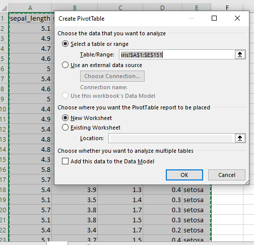

# Analysis_of_Iris_flowers

## INTODUCTION
This dataset includes measurements of the sepal length, sepal width, petal length and petal width of 150 iris flowers, which belong to 3 different species: setosa, versicolor and virginica. The iris dataset has 150 rows and 5 columns, which are stored as a dataframe, including a column for the species of each flower.

**The description of its variables includes**:

 Sepal.Length - The sepal.length represents the length of the sepal in centimetres.
 
Sepal.Width - The sepal.width represents the width of the sepal in centimetres.

Petal.Length - The petal.length represents the length of the petal in centimetres.

Species - The species variable represents the species of the iris flower, with three possible values: setosa, versicolor and virginica.
Problem Statement

**The goal of this project is to**

•	Analyze the relationship between the different features of the Iris flower and 

•	classify the flower species based on the feature values

**Skills and concepts demonstrated**

•	Pivot table and pivot chart

**Data Source**;

The dataset used for this work is gotten from Zentrix Africa Technology Institute for student project. 

**INSIGHT**

The relationship between the 3 Iris flower species (Setosa, versicolor and virginica)

•	They all has sepal length and sepal width in centimeters

•	They all has petal length and petal width in centimeters

Virginical species has the highest total length and width with the total sepal length of 329.4cm, sepal width of 148.7cm and total petal length of 277.6cm and petal width of 101.3cm

 Versicoloe species has the total sepal length of 296.8cm, sepal width of 138.5cm and total petal length of 213cm and petal width of 66.3cm
 
Setosa species has the total sepal length of 250.3cm, sepal width of 170.9cm and total petal length of 73.2cm and petal width of 12.2cm

**The screenshoot of the pivot table, chart and visual are uploaded below**;

Dataset view

Data process into pivot table

Labelling view

visual

